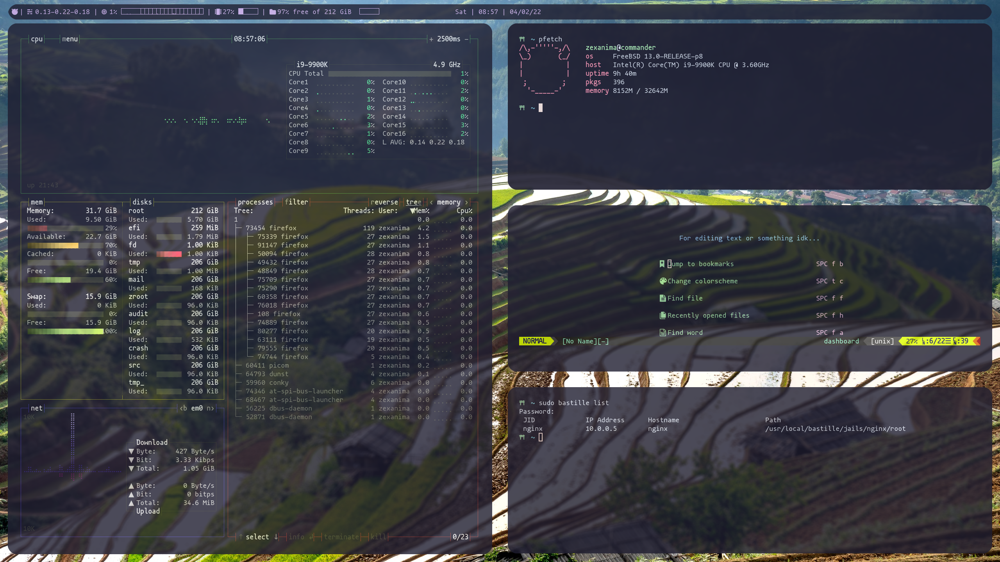

# LeftWM themes - Catppuccin (More or less) 

## Table of Contents

<!-- vim-markdown-toc GFM -->

* [Overview](#overview)
* [config.sh](#configsh)
* [Fonts](#fonts)
* [dotfiles](#dotfiles)
* [TODO](#todo)
* [Credit](#credit)

<!-- vim-markdown-toc -->

## Overview
**Colorscheme**: Catppuccin

**Font**: mononoki Nerd Font

## config.sh
Some portions of theme I switched off by default since they perminatly add files or modify your system in a 
potentially undesired way. Make sure you read the config.sh script and enable the things you want.

## Fonts
These are the only thing that is installed(copied) to your system that is not undone by `down`.

## dotfiles
Application specific themes and such I've included in my dot files.

## TODO

- [] Fix weirdness with dunst
- [] Custom color scheme

## Credit

A lot of the stuff here is taken from the [catppuccin repos](https://github.com/catppuccin/catppuccin). Originally
this was a clone of the [forest](https://github.com/lex148/forest/tree/fae637e400b01823f09173f3226cf6aa5925c029) theme but not much of it remains except the fonts script.
